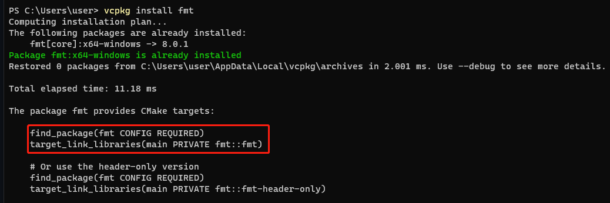
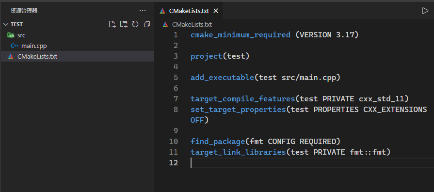
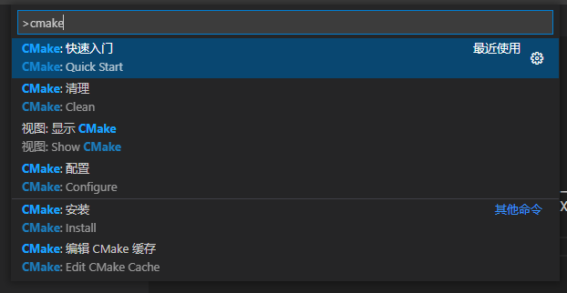
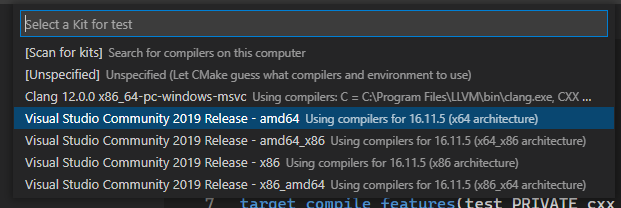
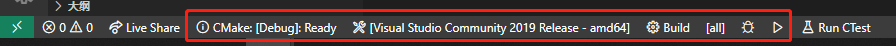
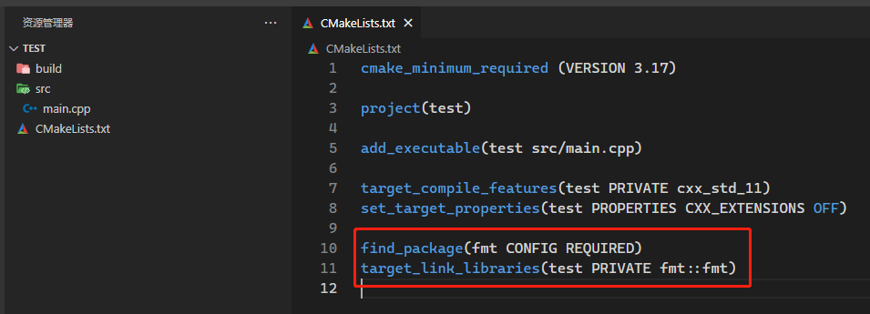
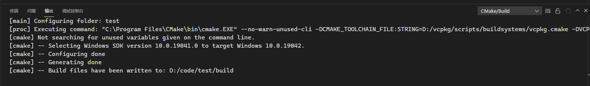
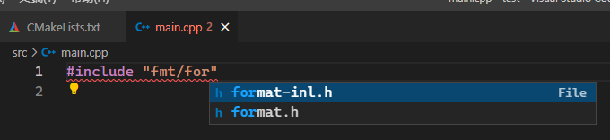
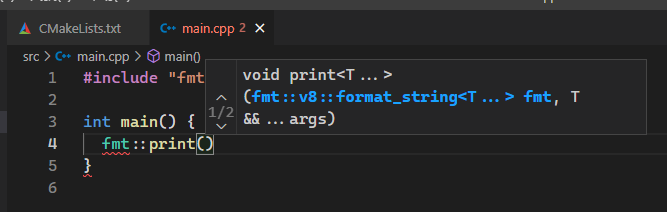
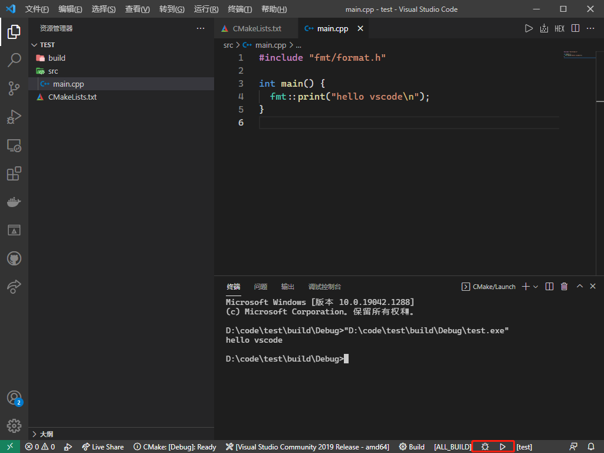

# vs code + cmake + vcpkg搭建c++开发环境

目前网络上有很多关于使用vs code开发c++的教程，但是基本都止步于使用code runner跑跑简单demo

但是在实际工作中，整个工程比较复杂，涉及众多源文件、库，甚至子项目等等，仅仅使用code runner无法满足我们的需求，所以我配合c++工程中常用的cmake（编译工具）和vcpkg（包管理器）在vs code中搭建一套可用于实际工作的c++开发环境

## 先决条件

### visual studio

[官网](https://visualstudio.microsoft.com/zh-hans/)

社区版即可，安装msvc编译器和英语语言包

### cmake

[官网](https://cmake.org/)

记得安装过程中勾选将cmake添加到环境变量

### vcpkg

[官网](https://vcpkg.io/)

[github](https://github.com/microsoft/vcpkg)

## 配置vs code

### 扩展

#### 必备

* [C/C++](C/C++)
* [CMake](https://marketplace.visualstudio.com/items?itemName=twxs.cmake)
* [CMake Tools](https://marketplace.visualstudio.com/items?itemName=ms-vscode.cmake-tools)

#### 添彩

* [Better C++ Syntax](https://marketplace.visualstudio.com/items?itemName=jeff-hykin.better-cpp-syntax)：更好的语法着色，需要配合主题使用
* [Clang-Format](https://marketplace.visualstudio.com/items?itemName=xaver.clang-format)：代码格式化工具

### 设置

按F1，输入“setting.json"，打开设置，添加：

```
"cmake.configureSettings": {
    "CMAKE_TOOLCHAIN_FILE": "D:/vcpkg/scripts/buildsystems/vcpkg.cmake",
    "VCPKG_TARGET_TRIPLET": "x64-windows"
}
```

其中`CMAKE_TOOLCHAIN_FILE`为vcpkg安装目录，`VCPKG_TARGET_TRIPLET`为构建平台，需要与vcpkg安装的包平台以及之后我们的项目选择的平台一致

p.s. 这是vs code中使用cmake集成vcpkg的唯一方法，我认为应当设置成图形化配置并且提供相关引导，这里也是网上最不全面的部分，很多人会卡在这一步

## 小试牛刀

这里我们先用vcpkg安装fmt库，然后用vscode新建一个CMake项目，使用fmt打印，验证智能提示和编译

### 使用vcpkg安装fmt库

请确保这里安装了带有英语包的vs，同时简单阅读了vcpkg的官方教程

打开终端，输入`vcpkg install fmt`



我这里是已经安装过了，我们将红框里的部分复制，稍后会在配置CMakeLists.txt时用的

### 新建CMake工程

这里我们新建一个文件夹，然后在上面点右键选择“通过Code打开”，我们在vscode中创建CMakeLists.txt文件，在创建src目录和其下的main.cpp，并在CMakeLists.txt中输入以下文本



这时候vscode还没有自动识别我们的CMake，需要按下F1（ctrl + shift + p），输入cmake，选择“CMake：快速入门”



然后选择我们的编译工具，这里我选择x64的环境



然后稍等片刻，最下方的状态栏就会显示我们工程的cmake信息



### 引入fmt库

首先在CMakeLists.txt中，粘贴我们使用vcpkg安装fmt库，提示的那两行代码，注意，代码中的main要改成我们的程序名（add_executable中的名字）



这时候保存CMakeLists.txt，会自动触发cmake缓存，如果成功，我们可以在下方的[输出]中，看到



同时也可以在执行cmake的参数中，看到我们上面配置的vcpkg的安装目录和构建平台

这时候我们再打开main.cpp，开始愉快的编写代码吧





最后，我们可以点击状态栏中编译、调试或运行图标，来编译运行CMake工程了


